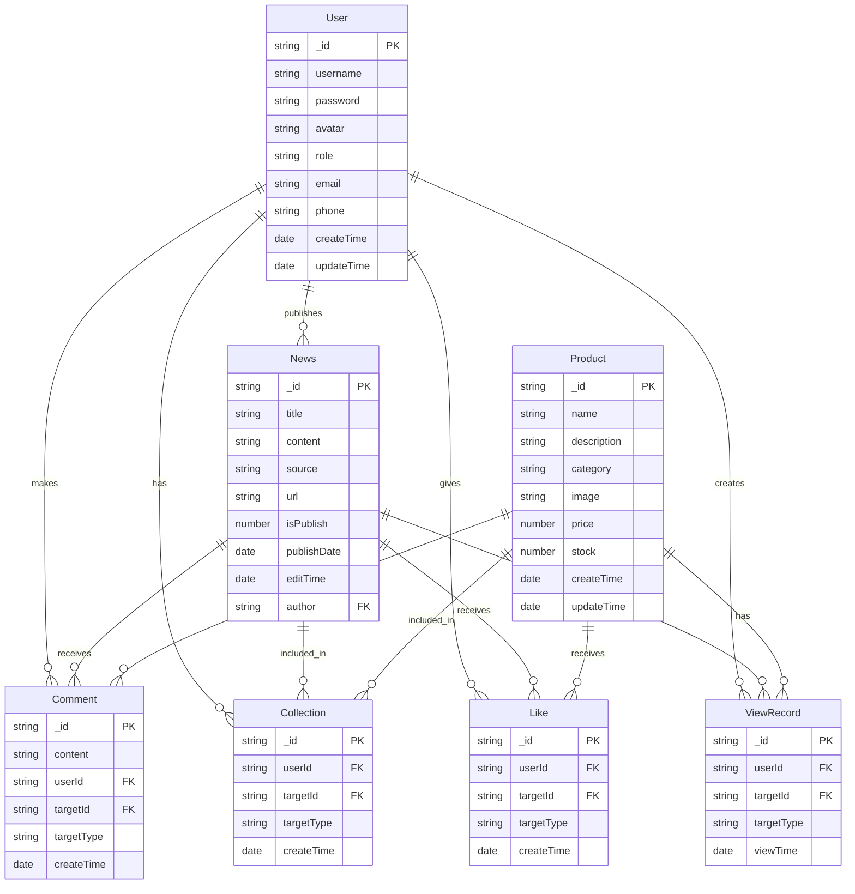

# 数据库ERD设计

## 实体关系图

## 实体说明

### User（用户）
- 主键：_id
- 存储用户基本信息，包括用户名、密码、头像等
- 用户角色区分普通用户和管理员

### News（新闻）
- 主键：_id
- 外键：author（关联User）
- 存储新闻内容，包括标题、内容、来源等
- isPublish字段标识是否发布

### Product（产品）
- 主键：_id
- 存储产品信息，包括名称、描述、类别等
- 包含价格和库存等商业属性

### Comment（评论）
- 主键：_id
- 外键：userId（关联User）
- 外键：targetId（关联News/Product）
- targetType区分评论目标类型

### Collection（收藏）
- 主键：_id
- 外键：userId（关联User）
- 外键：targetId（关联News/Product）
- targetType区分收藏目标类型

### Like（点赞）
- 主键：_id
- 外键：userId（关联User）
- 外键：targetId（关联News/Product）
- targetType区分点赞目标类型

### ViewRecord（浏览记录）
- 主键：_id
- 外键：userId（关联User）
- 外键：targetId（关联News/Product）
- targetType区分浏览目标类型

## 关系说明

1. 用户与新闻/产品：一对多
   - 一个用户可以发布多条新闻
   - 一个用户可以对多个新闻/产品进行评论、收藏、点赞和浏览

2. 新闻/产品与互动：一对多
   - 一条新闻/产品可以收到多个评论
   - 一条新闻/产品可以被多次收藏
   - 一条新闻/产品可以收到多个点赞
   - 一条新闻/产品可以被多次浏览

3. 用户与互动：一对多
   - 一个用户可以发表多条评论
   - 一个用户可以收藏多个目标
   - 一个用户可以点赞多个目标
   - 一个用户可以浏览多个目标